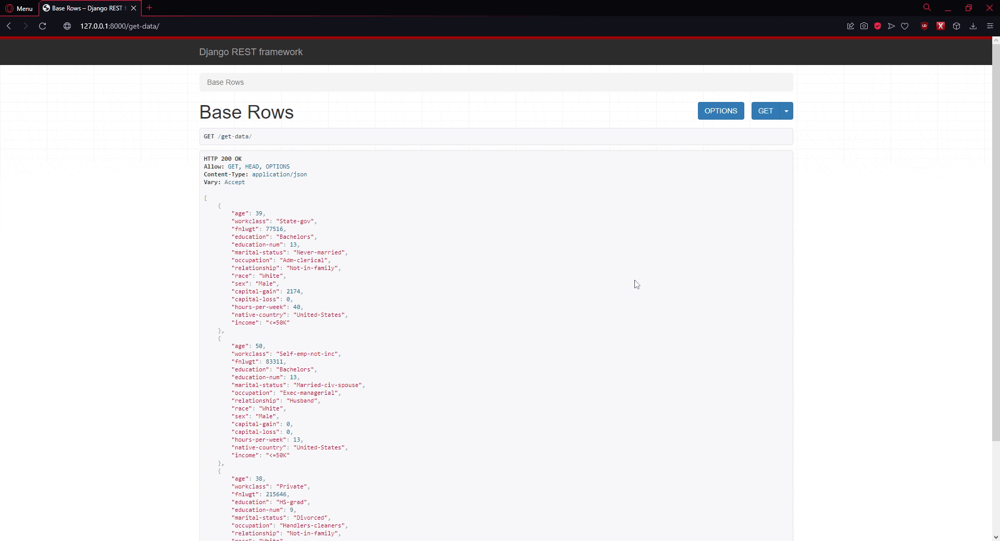

# Small_rest_project

-----------
This is rest project which uses `Django Rest Framework` with a connected Database.

In output it returns **details of person or persons** with given id.

The operation of the program isn't difficult, but it has extensive error handling.

Below is a link to the database I used.

Db: https://raw.githubusercontent.com/pplonski/datasets-for-start/master/adult/data.csv

## Setup
To use it you have to go to the `Small_rest_project` directory in the console:
```
C:\Users\user> cd Small_rest_projekt
```
Then go to the `backend/server` directory:
```
C:\Users\user\Small_rest_project> cd backend\server
```
Now all that's left, is to **run the program** in console.
```
py manage.py runserver
```

## Endpoints
In respone you will have http link. Add `get-data` at the end of link to enter the base stage of app.

It returns first 3 people in database.
```
127.0.0.1:8000/get-data
```
To return details of single person add `get-data/'number'` at the end of link.
```
127.0.0.1:8000/get-data/1
```
You can return many persons. To do it, you need to add second number after `/`.
```
127.0.0.1:8000/get-data/1/5
```
It outputs details of 5 people from id 1 to 5 in this case.

## App appearance

Below you can see how it looks:



Check `media` folder for more images.

### And that's it 🎉
